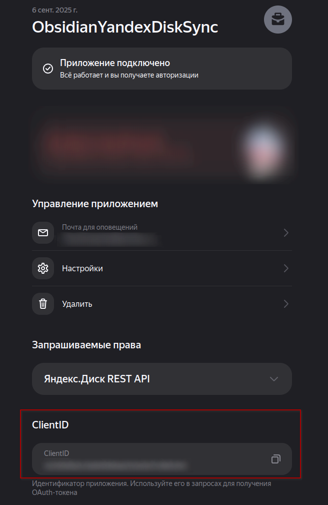

Yandex Disk Sync (Obsidian plugin)

[Russian](Docs/README_ru.md) | [English](./README.md)

Overview
- Synchronizes notes and attachments between Obsidian and Yandex.Disk (REST + OAuth).
- Works on Desktop and Mobile (uses `requestUrl`).

Features
- OAuth (paste token), choose regional portal (oauth.yandex.ru/.com).
- Works in the “application folder”: by default uses `app:/` (no extra permissions needed).
- Per‑vault subfolder: “Vault folder name” (defaults to the vault name).
- Modes: two‑way / upload / download; configurable deletion policy.
- Conflicts: newest‑wins (with time skew tolerance) or duplicate‑both.
- Ignore patterns, local scope, maximum size, upload/download concurrency.
- Status‑bar indicator + Progress window (real‑time counters, Cancel/Copy/Sync/Dry‑run).
- Diagnostics (resizable window, copy, newest logs on top, number of lines configurable).
- Auto‑sync by interval + sync on startup (with delay).
- Field descriptions localized (RU/EN). Field names are in English.

OAuth application registration (Client ID)
1) Open https://oauth.yandex.ru (or https://oauth.yandex.com).
2) Create an application with access to “Yandex.Disk REST API”. For most scenarios choose “access to the application folder”.

3) When creating, specify

- Application name, e.g., ObsidianYandexDiskSync
- Your email
- Choose the data access type; recommended: “Access to the application folder on Disk”. In this case the sync folder will be `disk/Applications/ObsidianYandexDiskSync`.

4) Copy the Client ID.

Initial setup (Settings → Yandex Disk Sync)
- Language: pick the language of help texts (Auto/English/Russian).
- **Required settings** (group labelled the same in the UI):
  - OAuth base URL: `https://oauth.yandex.ru` (RU accounts) or `https://oauth.yandex.com` (international). Use the nearby `Open OAuth portal page` button if you need to open the management site.
  - Client ID: paste the Client ID you received when registering the application. The same `Open OAuth portal page` button is available here for quick access to the Yandex portal.
  - Access token: press `Open OAuth token page`, grant access in the browser, then copy the `access_token` from the redirected URL and paste it into the field. The value is saved automatically; clear the field to disconnect.
- **Optional settings** (grouped below):
  - OAuth scopes (optional): leave empty to reuse the application permissions (required for “application folder”; otherwise you’ll get `invalid_scope`).
  - Remote base folder: root path in the cloud (recommended `app:/`).
  - Vault folder name: subfolder inside Remote base (defaults to your vault name). Effective cloud root: `<Remote base>/<Vault folder name>`.
  - Local scope: subfolder in the vault to sync (empty = entire vault).
  - Ignore patterns: comma‑separated patterns, e.g., `.obsidian/**, **/.trash/**, **/*.tmp`.
  - Sync mode: two‑way | upload | download.
  - Delete policy: mirror (propagate deletions according to the last‑sync index) | skip (never delete).
  - Conflict handling Strategy: newest‑wins (by timestamp; within tolerance — local) | duplicate‑both (keep both versions).
  - Time skew tolerance (sec): allowed time skew for newest‑wins (typically 120–300).
  - Max file size (MB): skip local files larger than this threshold on upload (default 200).
  - Concurrency (upload/download): parallel workers (recommended 1–3 / 1–4).
  - Auto‑sync interval (minutes): 0 — off; works only while Obsidian is open.
  - Sync on startup: start sync on launch; if needed set Startup delay (sec).

Tips: you can always reach the OAuth management portal from either required field with the `Open OAuth portal page` button, and re-run the token flow with `Open OAuth token page` next to the Access token field.

Usage
- Ribbon button: starts “Sync” (if already running, won’t start another).
- Status bar: shows state and counters; click to open the Progress window.
- Progress window: phase, counters, recent operations; buttons Sync, Dry-run, Copy all, Cancel.
- Commands: “Sync now”, “Dry‑run (plan only)”, “Diagnostics”.

How synchronization works (brief)
- Scans local files (respecting Local scope, Ignore patterns, Max size) and the cloud under `<Remote base>/<Vault folder name>`.
- Builds an operation plan: upload/download, remote‑delete/local‑delete, conflicts.
- Executes with concurrency limits; backs off on 429; creates parent folders as needed.
- Updates the index (timestamps/revisions) when finished.

Modes and deletions
- two‑way: sync in both directions; with `mirror`, deletions propagate provided the other side hasn’t changed since the last sync.
- upload: only local changes → cloud; does not pull from cloud.
- download: only cloud → local; does not push local changes.
- `skip`: never delete automatically.

Conflicts
- newest‑wins: compares timestamps, picks the newer side; within tolerance — prefers local.
- duplicate‑both: creates two local copies: “(conflict … local)” and “(conflict … remote)”.

Diagnostics
- Shows environment (paths, modes, strategy), result of the last API check, last HTTP code, and recent log lines (newest on top). Text can be copied. Number of lines is configurable in settings.

Security
- Client ID can be public. Never publish the Client Secret or tokens.
- Tokens are stored in the current vault’s plugin data.

Common issues
- `invalid_scope` on Connect: clear “OAuth scopes” (leave empty) for “application folder” apps.
- 403: the token has no rights to the path — use `app:/` or a token with full access for `disk:/`.
- 409: parallel/duplicate operations or parent directory not yet created — the plugin will retry/create; reduce concurrency if it repeats.
- “File name cannot contain \\ / :”: the plugin avoids aliases in local paths; if you see this, check the target local path in Diagnostics.

Yandex Disk REST documentation: https://yandex.com/dev/disk/rest/

## Star History 

